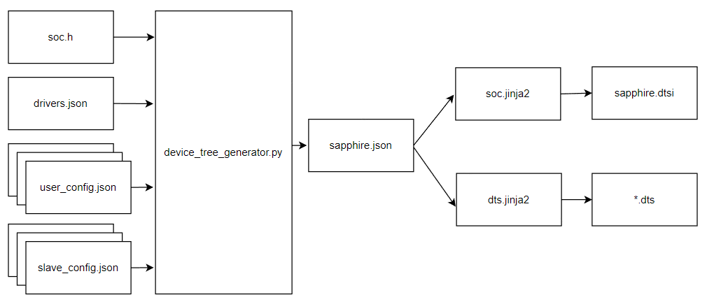

# Sapphire-soc-dt-generator

## Introduction

A script to generate device tree for Linux and Zephyr based on Efinix RISCV Sapphire SoC configuration. A device tree is a hierachical data structure primarily used to describe hardware. The output files are in *.dts, *.dtsi format which will be used by the operating system during peripheral initialization.

The table below show the files used by `device_tree_generator.py` script.

| File                | Description                                                                                                                                                                                                                         | Input/Output |
| ------------------- | ----------------------------------------------------------------------------------------------------------------------------------------------------------------------------------------------------------------------------------- | ------------ |
| `soc.h`             | The header file generated from Efinity IP Manager. Usually located in `$EFINITY_PROJECT/$embedded_sw/<project_name>/bsp/efinix/EfxSapphireSoc/include/soc.h`. It contain information of peripheral addresses and size, cpus caches. | Input        |
| `user_config.json`  | The configuration file to override the property of existing device node such as `name`, `reg`, `label`, `private_data`, etc. (optional)                                                                                             | Input        |
| `slave_config.json` | The configuration file to add the slave device to master node. The slave device could be i2c based sensor, spi flash, etc. (optional)                                                                                               | Input        |
| `drivers.json`      | The file contain peripheral drivers name which does not provided in soc.h. Also contain hard coded information of peripherals.                                                                                                      | Input        |
| `*.dtsi`            | Device tree include file. This file describe the top level of SoC such as number of cpu, bus, peripheral attach to bus such as spi, i2c, uart, gpio, etc.                                                                           | Output       |
| `*.dts`             | Device tree file. This file describe board level such as RAM size, peripheral that enable on the bus.                                                                                                                               | Output       |

## Device Tree Generation Flow

The `device_tree_generator.py` script read 4 types of files which are `soc .h` an, `drivers.json`, `user_config.json` and `slave_config.json`. The script then generate an intermediate json file called `sapphire.json`. The content of `sapphire.json` then converted to device tree format called `sapphire.dtsi` and `*.dts` using the template files `soc.jinja2` and `dts.jinja2` respectively. The intermediate `sapphire.json` file gets removed after generate `*.dtsi` and `*.dts` files. However, this file can be saved using `-j` argument when invoke  the script. The diagram below illustrate the flow of device tree generation.




## Usage

```
usage: device_tree_generator.py [-h] [-b BUS] [-c USER_CONFIG] [-d DIR]
                                [-o OUTFILE] [-j] [-s SLAVE]
                                soc board {linux,zephyr} ...

Device Tree Generator

positional arguments:
  soc                   path to soc.h
  board                 development kit name such as t120, ti60

optional arguments:
  -h, --help            show this help message and exit
  -b BUS, --bus BUS     Specify path to bus architecture for the SoC in json
                        format. By default is "config/single_bus.json"
  -c USER_CONFIG, --user-config USER_CONFIG
                        Specify path to user configuration json file to
                        override the APB slave device property
  -d DIR, --dir DIR     Output generated output directory. By default is dts
  -o OUTFILE, --outfile OUTFILE
                        Override output filename. By default is sapphire.dtsi
  -j, --json            Save output file as json format
  -s SLAVE, --slave SLAVE
                        Specify path to slave device configuration json file.
                        This file is a slave node for the master device which
                        appear in DTS file.

os:
  {linux,zephyr}
    linux               Target OS, Linux
    zephyr              Target OS, Zephyr
```

### Generate Device Tree

#### Linux

```bash
python3 device_tree_generator.py -s config/linux_slaves.json /path/to/soc.h ti180 linux
```

#### Zephyr

```bash
usage: device_tree_generator.py soc board zephyr [-h] [-em]
                                                 socname zephyrboard

positional arguments:
  socname           Custom soc name for Zephyr SoC dtsi
  zephyrboard       Zephyr board name

optional arguments:
  -h, --help        show this help message and exit
  -em, --extmemory  Use external memory. If no external memory enabled on the
                    SoC, internal memory will be used instead.
```

##### Example,

This is an example to generate device tree for Zephyr OS. It is based on Sapphire SoC and Ti180 board. The custom socname is `zoro` and the zephyrboard is `zero-one`.

###### Using on chip RAM

```bash
python3 device_tree_generator.py /path/to/soc.h ti180 zephyr zoro zero-one
```

###### Using external memory

```bash
python3 device_tree_generator.py /path/to/soc.h ti180 zephyr zoro zero-one -em
```

## Additional Resources

- [Device tree nodes structure](docs/device_tree_nodes.md)

- [Add slave node to device tree](docs/add_slave_node.md)

- [Modify device tree node](docs/modify_device_tree_node.md)