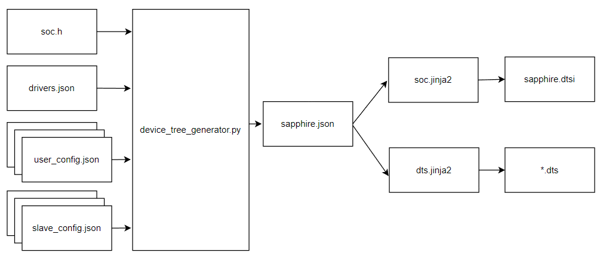

# Sapphire-soc-dt-generator

## Introduction

A script to generate device tree for Linux, U-Boot and Zephyr based on Efinix RISCV Sapphire SoC configuration. A device tree is a hierachical data structure primarily used to describe hardware. The output files are in *.dts, *.dtsi format which will be used by the operating system during peripheral initialization.

The table below show the files used by `device_tree_generator.py` script.

| File               | Description                                                                                                                                                                                                                                 | Input/Output |
| ------------------ | ------------------------------------------------------------------------------------------------------------------------------------------------------------------------------------------------------------------------------------------- | ------------ |
| `soc.h`            | The header file generated from Efinity IP Manager. Usually located in `$EFINITY_PROJECT/$embedded_sw/<project_name>/bsp/efinix/EfxSapphireSoc/include/soc.h`. It contain information of peripheral addresses and size, cpus caches.         | Input        |
| `user_config.json` | The configuration file to override the property of existing device node such as `name`, `reg`, `label`, `private_data`, etc and add the slave device to master node. The slave device could be i2c based sensor, spi flash, etc. (optional) | Input        |
| `drivers.json`     | The file contain peripheral drivers name which does not provided in soc.h. Also contain hard coded information of peripherals.                                                                                                              | Input        |
| `*.dtsi`           | Device tree include file. This file describe the top level of SoC such as number of cpu, bus, peripheral attach to bus such as spi, i2c, uart, gpio, etc.                                                                                   | Output       |
| `*.dts`            | Device tree file. This file describe board level such as RAM size, peripheral that enable on the bus.                                                                                                                                       | Output       |

## Device Tree Generation Flow

The `device_tree_generator.py` script read 3 types of files which are `soc.h` an, `drivers.json`, and `user_config.json`. The script then generate an intermediate python dictionary data structure within the memory which consists of device nodes and their properties. The template files such as `soc.jinja2` and `dts.jinja2` convert the data structure into device tree format and generate `*.dtsi` and `*.dts` respectively. The default output files are located in `output/{os_name}`, where `os_name` could be linux, zephyr or u-boot. The diagram below illustrate the flow of device tree generation.



## Dependencies

Require python3, pip3 and some python packages.

```
sudo apt-get install python3-pip
pip3 install -r requirements.txt
```

## Usage

```
usage: device_tree_generator.py [-h] [-c USER_CONFIGS] [-d DIR] [-g] [-m MACHINE] [-o OUTFILE] soc_configs board {linux,uboot,zephyr} ...

Device Tree Generator

positional arguments:
  soc_configs           path to soc.h
  board                 Provide the board name such as Ti375N1156, Ti375C529, Ti180J484, Ti60F225, T120F324

options:
  -h, --help            show this help message and exit
  -c USER_CONFIGS, --user-configs USER_CONFIGS
                        Provide the path to a user configuration JSON file to override default device properties. For example, /path/to/user-config.json.
  -d DIR, --dir DIR     Set the generated device tree output directory. Default directory is 'output'
  -g, --debug           Show debug messages.
  -m MACHINE, --machine MACHINE
                        Specify the machine architecture either 32-bit or 64-bit. Default is 32.
  -o OUTFILE, --outfile OUTFILE
                        Override the dtsi output filename. Default is sapphire.dtsi

Operating System:
  {linux,uboot,zephyr}
    linux               Target Linux device tree
    uboot               Target U-Boot device tree
    zephyr              Target Zephyr device tree
```

### Generate Device Tree

#### Linux

##### Example,

This is an example to generate device tree with multicores for Linux based on Sapphire SoC and Ti375C529 board. It use sample [soc.h](samples/multicores/soc.h). The generated device tree would be stored in `output/{os_name}`, where `os_name` could be `linux`, `u-boot` or `zephyr`.

```bash
python3 device_tree_generator.py \
-c config/linux/drivers.json \
-c config/linux/peripherals.json \
-c config/boards/ti375c529/memory.json \
-c config/linux/generic/spi-mmc.json \
samples/multicores/soc.h \
ti375c529 linux
```

> Please note that you are require to use your own soc.h which generated from Efinity software.

#### Zephyr

```bash
usage: device_tree_generator.py soc board zephyr [-h] [-em]
                                                 socname zephyrboard

positional arguments:
  socname           Custom soc name for Zephyr SoC dtsi
  zephyrboard       Zephyr board name

optional arguments:
  -h, --help        show this help message and exit
  -em, --extmemory  Use external memory. If no external memory enabled on the
                    SoC, internal memory will be used instead.
```

##### Example,

This is an example to generate device tree for Zephyr OS. It is based on Sapphire SoC and Ti180 board. The custom socname is `zoro` and the zephyrboard is `zero-one`. It use sample [soc.h](samples/multicores/soc.h).

###### Using on chip RAM

```bash
python3 device_tree_generator.py -c config/zephyr/slaves.json samples/multicores/soc.h ti180 zephyr zoro zero-one
```

###### Using external memory

```bash
python3 device_tree_generator.py -c config/zephyr/slaves.json samples/multicores/soc.h ti180 zephyr zoro zero-one -em
```

## Additional Resources

- [Device tree nodes structure](docs/device_tree_nodes.md)

- [Add slave node to device tree](docs/add_slave_node.md)

- [Modify device tree node](docs/modify_device_tree_node.md)